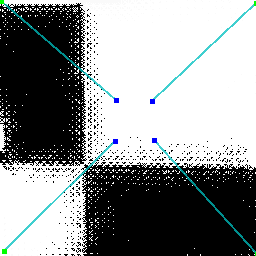

### Report on Image warping

<a href="../images/articles/research_02/Report_on_Image_warping.pdf">PDF online</a>

#### Inverse distance weighted interpolation

Inverse distance-weighted interpolation methods were originally proposed by Shepard and improved by a number of other authors, notably Franke and Nielson.

#### Radial basis function transform image warping

Transformations based on radial basis functions have proven to be a powerful tool in image warping.

#### Compare

From the figure below, we can simpliy feel that IDW is a little bit good at the fold-over control. On the other hand, the image warped by RBF is semed more flexible and ductile. (IDW(left) vs RBF(right))

&emsp;&emsp;&emsp;&emsp;&emsp;

#### FillHole

In order to fix the white line problem of my warping class, I figure out a simple way to fill the white hole. By using the pixel near the target point, the color of the white hole can be easily approximated.

&emsp;&emsp; &emsp;&emsp; &emsp;

&emsp;&emsp; &emsp;&emsp; &emsp; &emsp; &emsp; &emsp; &emsp;
