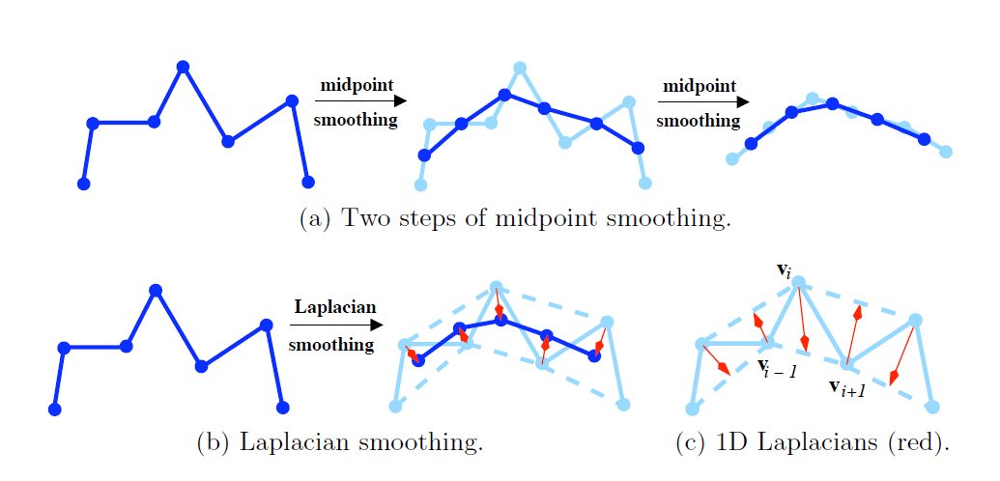

### 利用网格Laplace 矩阵的谱进行网格的压缩

<a href="../images/articles/research_04/Report-of-Spectral-Compressiontex.pdf">PDF online</a>
Laplace矩阵是图论中用到的一种重要矩阵，给定一个有$n$个顶点的图G=(V,E)，其拉普拉斯矩阵被定义为L=I-DA，其中D为图的度矩阵，A为图的邻接矩阵。利用网格Laplace矩阵的谱进行网格的压缩，可以很好的近似原图像。其原理类似于DFT。

#### Laplace矩阵

$$
L_{i,j} = 
\begin{cases}
1& 				\text{, }i = j\\\\
-1/d_i&			\text{, }(i,j)\in E\\\\
0& 				\text{, else}
\end{cases}
$$
或者，
$$
L_{i,j} = 
\begin{cases}
d_i& 				\text{, }i = j\\\\
-1&			\text{, }(i,j)\in E\\\\
0& 				\text{, else}
\end{cases}
$$
Laplacian光滑变换，其变换矩阵为\\(S=I-\frac{1}{2}L\\)。它的作用大致可由下图表示出来：

#### 基于谱的网格压缩

对Laplace矩阵进行特征值分解，即谱分解:
$$
L = VDV^{-1}
$$
其中，$D$为特征值构成的对角阵，V为对应的特征向量组成的矩阵\\(V = \{v_1,v_2,...,v_n\}\\)。

假设，我们输入的信号为X，则基于谱的压缩可以表示为:
$$
X' = VV^{T}X
$$
其中，V为对应的前k个特征值最小的特征向量组成的矩阵\\(V_{(k)} = \{v_1,v_2,...,v_k\}\\)。我们把k叫作谱系数。

对应于傅里叶变换，前k个特征值最小的特征向量组成的矩阵\\(V_{(k)}\\)是包含了图G的主要信息，而细节信息都将在\\(V^{res}_{(k)} = \{v_k,v_k+1,...,v_n\}\\)中。由此，我们可以计算得误差函数：
$$
Loss = \|X - X'\| = \|{V^{res}_{(k)}}^{T}X\|
$$

