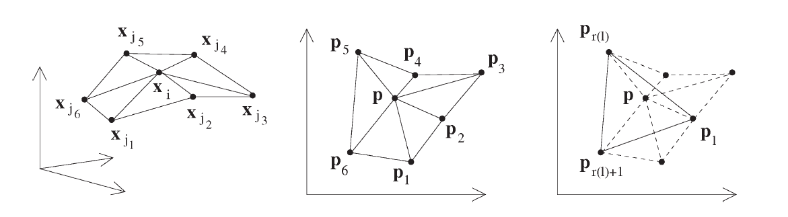
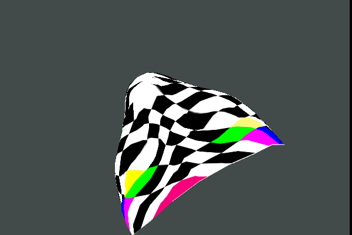
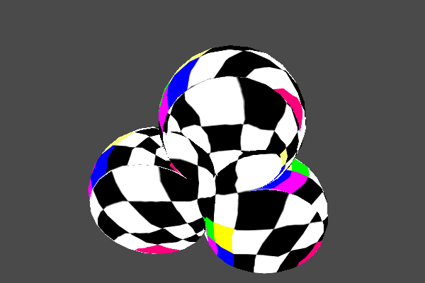

### 网格参数化与纹理映射

<a href="../images/articles/research_03/Report_of_Parameterization.pdf">PDF online</a>

&emsp;&emsp; 三维曲面离散化为三维网格后，为了进行纹理贴图，有时还要展开到二维的uv 坐标平面上。虽然大部分空间曲面都不是可展的，但是在曲面的局部区域观察是可以表示成f(u,v) 的形式的，这个过程在数字图形处理中的术语叫参数化(Parameterization)。从三角网格的角度，每个三角形和它的uv平面上的对应都是仿射变换的关系，根据不同的应用，通常要给这种局部映射加约束，比如要求角度或者面积的变形最小等，在曲面不撕裂的情况下，这种假设只能近似满足。
&emsp;&emsp; &emsp;&emsp; 

 
&emsp;&emsp; 纹理映射是真实感图像制作的一个重要部分，运用它可以方便的制作出极具真实感的图形而不必花过多时间来考虑物体的表面细节。然而纹理加载的过程可能会影响程序运行速度，当纹理图像非常大时，这种情况尤为明显。如何妥善的管理纹理，减少不必要的开销，是系统优化时必须考虑的一个问题。还好，OpenGL 提供了纹理对象对象管理技术来解决上述问题。与显示列表一样，纹理对象通过一个单独的数字来标识。这允许OpenGL 硬件能够在内存中保存多个纹理，而不是每次使用的时候再加载它们，从而减少了运算量，提高了速度。
&emsp;&emsp; &emsp;&emsp; 
 
 
&emsp;&emsp; &emsp;&emsp; 

 