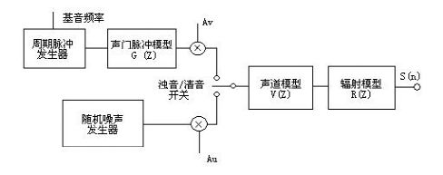
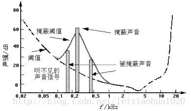

### 小波分析在语音信号分析中的应用

<a href="../images/articles/research_01/main.pdf">PDF online</a>

&emsp;&emsp; 语言信息主要包含在语音信号的参数之中，因此准确而迅速地提取语言信号的参数是进行语音信号处理的关键。常用的语音信号参数有：共振峰幅度、频率与带宽、音调和噪音、噪音的判别等。后来又提出了线性预测系数、声道反射系数和倒谱参数等参数。 
&emsp;&emsp; &emsp;&emsp; 

 
&emsp;&emsp; 20世纪80年代之后，研究语音信号非平稳参数分析方法迅速发展，人们提出了一整套快速的算法，还有利用优化规律实现以合成信号统计分析参数的新算法，取得了很好的效果。其中，有些便是基于小波和小波包变换得出的算法。如：语音信号在其频域中的分析技术，小波变换和EMD 分解在端点检测中的应用，以及小波-自相关函数法在带噪音的语音中进行的基音检测。 
&emsp;&emsp; &emsp;&emsp; &emsp;&emsp; 

 
&emsp;&emsp; 本文通过在matlab中进行实验，探寻小波分析在语音信号分析与合成中的应用，以此探究进一步理解小波变换在实际中的应用，更深入的感悟小波分析在应用中带来的方便。具体学习和实践了利用窗口傅里叶变换绘制语音信号的语谱图(*Spectrogram.m*)，通过小波变换提取简单的基因频率(*Peaks.m*)，用小波包对语音在Bark 域上分解并压缩后重构(*WavletBarkms_Decomposition.m*)，还有有关端点检测的小波分解平均幅值法(*WT_VAD.m*)与小波包的BARK 子带分离频带方差(*WPB_VAD.m*)，这一系列的编程实践与理论的学习都让我体会到了小波分析在信号处理中独特的地位。 